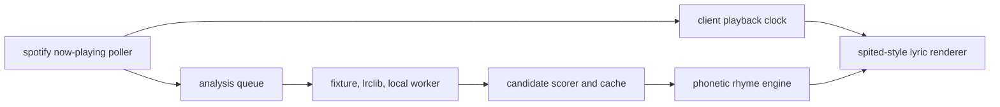

# saeshify

live rhyme instrumentation for spotify playback clocks.

saeshify is a portfolio-system research demo for realtime backend/io. it watches a
playback clock, resolves the active track, scores lyric and timing sources,
computes phonetic rhyme families, and renders a Spited-style rhyme sheet as the
track moves.

the visible thing is music tech. the real project is the pipeline around it:
external playback state in, analysis work queued and cached, clock drift corrected
locally, and a dense visual surface kept in sync with the audio.

## current status

- public repo: fixture-safe demo data only.
- private local demo: supports real song assets under ignored `public/local-media/`.
- target sample space: Madvillainy, the 2004 Madvillain album, plus a few adjacent
  MF DOOM tracks for stress testing dense rhyme schemes.
- public surface: `saeshify.com` should be the standalone project landing page.
- portfolio framing: experimental system, not a commercial streaming product.
- hard boundary: do not commit downloaded audio or full copyrighted lyrics.

## demo

```bash
npm install
cp .env.example .env.local
npm run dev
```

open `http://localhost:3000/instrument`.

without private assets, the instrument runs fixture mode. with a local manifest,
ignored audio, and enhanced `.lrc` files, it can render real private songs with
word-level karaoke timing.

## private madvillainy bank

copy `docs/mf-doom-local-bank.template.json` to:

```text
public/local-media/manifest.json
```

then add legally supplied local audio and matching enhanced lrc files beside it.
the app loads private local tracks ahead of public fixtures and keeps those files
out of git.

enhanced lrc shape:

```text
[00:06.00]<00:06.00>first <00:06.32>timed <00:06.68>word <00:07.04>run
[00:08.20]<00:08.20>next <00:08.54>bar <00:08.91>lands <00:09.22>clean
```

line timestamps drive bar layout and scroll position. embedded word timestamps
drive exact reveal timing.

## system shape



## stack

- next.js 16, react 19, typescript, tailwind.
- cloudflare workers through `@opennextjs/cloudflare`.
- spotify web api for now-playing snapshots.
- local enhanced lrc files for private real-song timing.
- optional local worker path for heavier transcription or alignment.
- vitest, eslint, github actions, wrangler dry-run checks.

## why this exists

saeshify is meant to show realtime backend/io taste in a way that is easier to
understand than a generic agent dashboard. a recruiter can watch the demo and see
a live external state stream become a synchronized visual product.

strongest project claims:

- polling an external playback source without pretending it has webhooks.
- interpolating a local clock and correcting drift.
- running multiple timing and lyric analysis paths behind one schema.
- caching analyses by track and source version.
- rendering bar-level rhyme families with word-level active timing.
- keeping public github clean while supporting private real-song demos.

## docs

- `docs/saeshify-2026-research.md`: current technical anchors and direction.
- `docs/implementation-spec.md`: implementation spec for the next build pass.
- `docs/codex-goal-prompt.md`: long-running goal prompt for codex.
- `docs/local-private-bank.md`: private song-bank setup.
- `docs/spited-reference-study.md`: visual reference notes.
- `docs/cloudflare-cutover.md`: dns and worker cutover checklist.

## commands

```bash
npm run lint
npm test
npm run build
npm run cf:build
npx wrangler deploy --dry-run
```

`npm run cf:build` strips `public/local-media` from the OpenNext asset bundle
before deploy or dry-run.

## deploy boundary

do not push, deploy, flip dns, or bind `saeshify.com` without explicit sign-off.
`saeshify.com` is the intended landing page, but the repo stays safe to run
locally until the cloudflare cutover is approved.
